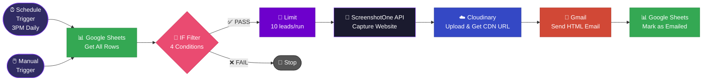
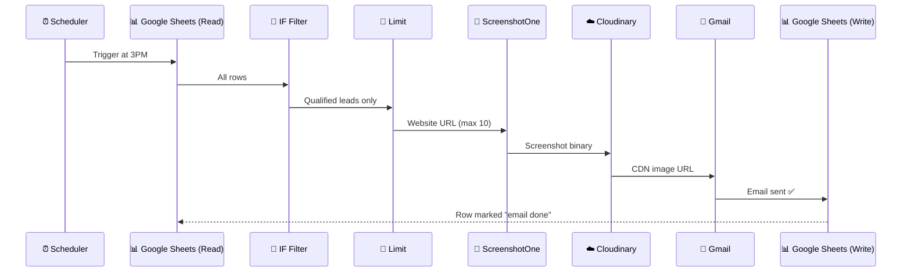

<div align="center">


<br/>


&nbsp;

&nbsp;

&nbsp;


</div>

---

## 📌 Overview

**Mails to Leads** is a fully autonomous cold-outreach automation built in [n8n](https://n8n.io). It runs every day at **3PM**, reads qualified leads from a Google Sheet, takes a **live screenshot of each lead's website**, uploads it to **Cloudinary**, and sends a personalised **HTML email** — all without a single human click.

After sending, it marks the row as *"email done"* in the sheet so no lead is ever contacted twice.

> **Live at:** [Slora AI](https://www.sloraai.com/) — serving real outreach for real clients daily.

---

## ⚡ Workflow Architecture



---

## 🔗 Node-by-Node Breakdown

### 1 · Triggers

Two ways to start the workflow:

| Trigger | Type | When |
|:---|:---|:---|
| ⏰ **Schedule Trigger** | Automated | Every day at **15:00 (3PM)** |
| 🖱️ **Manual Trigger** | On-demand | When you click *"Execute workflow"* in n8n |

Both triggers feed into the same pipeline. The schedule trigger has **no connection** in the JSON (it's wired but currently routes to manual for testing), while the manual trigger kicks off the full chain.

---

### 2 · Google Sheets — Read Leads

```
Node   : Get row(s) in sheet
Sheet  : Tatto shops leads  →  tab: mail saved
Action : Reads ALL rows from the sheet
```

**Sheet columns used downstream:**

| Column | Purpose |
|:---|:---|
| `Mail ids` | Recipient email address |
| `Website` | URL to screenshot |
| `CheckBox` | Manual approval flag |
| `Emailed?` | Deduplication guard |

---

### 3 · IF Filter — Smart Qualification Gate

All **4 conditions must pass** (AND logic) for a lead to proceed:

```
╔══════╦═══════════════════╦════════════════════════════════════════╗
║  #   ║  Field            ║  Condition                             ║
╠══════╬═══════════════════╬════════════════════════════════════════╣
║  1   ║  Mail ids         ║  NOT empty  →  valid email exists      ║
║  2   ║  Website          ║  NOT empty  →  has a site to capture   ║
║  3   ║  CheckBox         ║  ≠ false    →  manually pre-approved   ║
║  4   ║  Emailed?         ║  IS empty   →  not yet contacted       ║
╚══════╩═══════════════════╩════════════════════════════════════════╝
```

> Leads failing any condition are silently dropped — no errors, no duplicates.

---

### 4 · Limit — Rate Control

```
Max items : 10 per execution
```

Prevents over-sending and keeps the workflow within API rate limits. Even if 100 leads qualify, only 10 get processed per run.

---

### 5 · HTTP Request — Website Screenshot

```
API     : ScreenshotOne  (screenshotone.com)
Method  : GET
Output  : JPEG binary image data
```

**Parameters sent:**

| Param | Value |
|:---|:---|
| `url` | Lead's website from sheet |
| `format` | `jpg` |
| `block_cookie_banners` | `true` — clean screenshots |

The raw binary JPG flows directly into Cloudinary.

---

### 6 · Cloudinary — CDN Upload

```
Operation : Upload File
Output    : secure_url  (public HTTPS image link)
```

Converts the raw screenshot binary into a permanent, publicly accessible CDN URL used in the email body as `{{ $json.secure_url }}`.

---

### 7 · Gmail — Send HTML Email

```
To      : {{ $('HTTP Request').item.json['Mail ids'] }}
Subject : personalised outreach
Body    : Full HTML email with embedded screenshot
```

**Email structure:**

```
┌─────────────────────────────────────┐
│           Slora AI Logo             │
├─────────────────────────────────────┤
│   [LIVE Screenshot of their site]   │
│        [ Visit Your New Site ]      │
├─────────────────────────────────────┤
│  CONSULTATION OFFER headline        │
│  "Find your dream Website Demo..."  │
│        [ Book a consultation ]      │
├─────────────────────────────────────┤
│  🔥 35% OFF special offer box       │
│  Why choose us? (3-column icons)    │
│    • Accelerate Growth              │
│    • Smarter Automation             │
│    • Enterprise Tech, Small Price   │
│        [ CLAIM MY 35% DISCOUNT ]    │
└─────────────────────────────────────┘
```

The personalisation hook: each lead sees a screenshot of **their own website** inside the email — making it feel handcrafted.

---

### 8 · Google Sheets — Log & Deduplication

```
Operation : Update row (matched by Mail ids)
```

After the email is sent, the sheet row is updated:

| Column | Written Value |
|:---|:---|
| `Emailed?` | `"email done"` |
| `Date` | Today's date (`YYYY-MM-DD`) |

This ensures the IF filter (Step 3) will skip this lead on all future runs.

---

## 📊 Data Flow Summary



---

## 🛠️ Tech Stack

<div align="center">

| Tool | Role |
|:---|:---|
|  | Workflow orchestration |
|  | Lead database + logging |
|  | Website capture |
|  | Image CDN hosting |
|  | HTML email delivery |

</div>

---

## 🚀 Setup Guide

### Prerequisites

- [ ] n8n instance (self-hosted or cloud)
- [ ] Google Sheets OAuth2 credentials configured in n8n
- [ ] Gmail OAuth2 credentials configured in n8n
- [ ] Cloudinary API credentials configured in n8n
- [ ] [ScreenshotOne](https://screenshotone.com) API key

### Google Sheet Structure

Your sheet must have these exact column headers:

```
Name | Phone | Mail ids | Country | Website | Address | Email Template | Image Url | New Site Url | CheckBox | Emailed? | Date
```

### To Activate

1. Import the workflow JSON into n8n
2. Connect all credential nodes (Google Sheets, Gmail, Cloudinary)
3. Replace the ScreenshotOne `access_key` with your own key
4. Update the Google Sheet URL in both Sheets nodes to your sheet
5. Toggle the workflow to **Active** ✅

---

## ⚙️ Configuration Reference

| Setting | Value |
|:---|:---|
| Execution mode | `v1` |
| Binary mode | `separate` |
| Max leads/run | `10` |
| Schedule | `15:00` daily |
| Workflow ID | `yphrR9L7urLmPTDv` |

---

## 📈 Why This Works

The personalisation loop is the secret:

```
Lead sees their OWN website in the email
        ↓
Instant credibility — "they did their research"
        ↓
Higher open rate → Higher reply rate → More consultations booked
```

Combined with the 4-point filter, only **genuinely qualified, approved** leads receive emails — keeping deliverability high and spam complaints near zero.

---

<div align="center">

**Built by [Abdul Rehman](https://github.com/ar-rehman786)**

[](mailto:abdulrehmanhameed4321@gmail.com)
&nbsp;
[](https://www.sloraai.com/)

</div>


